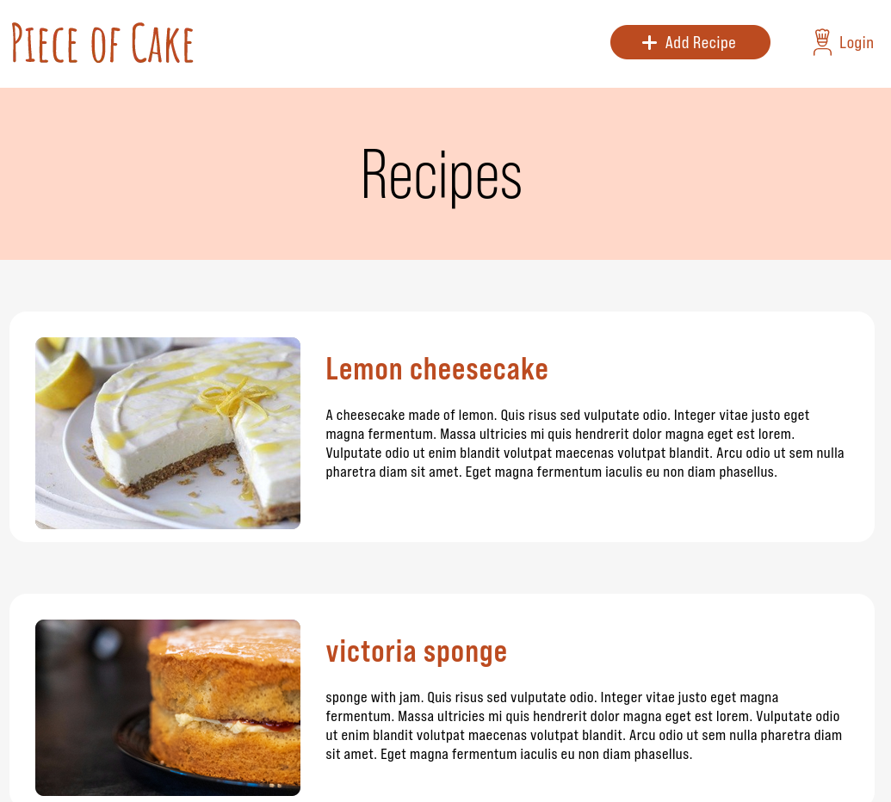
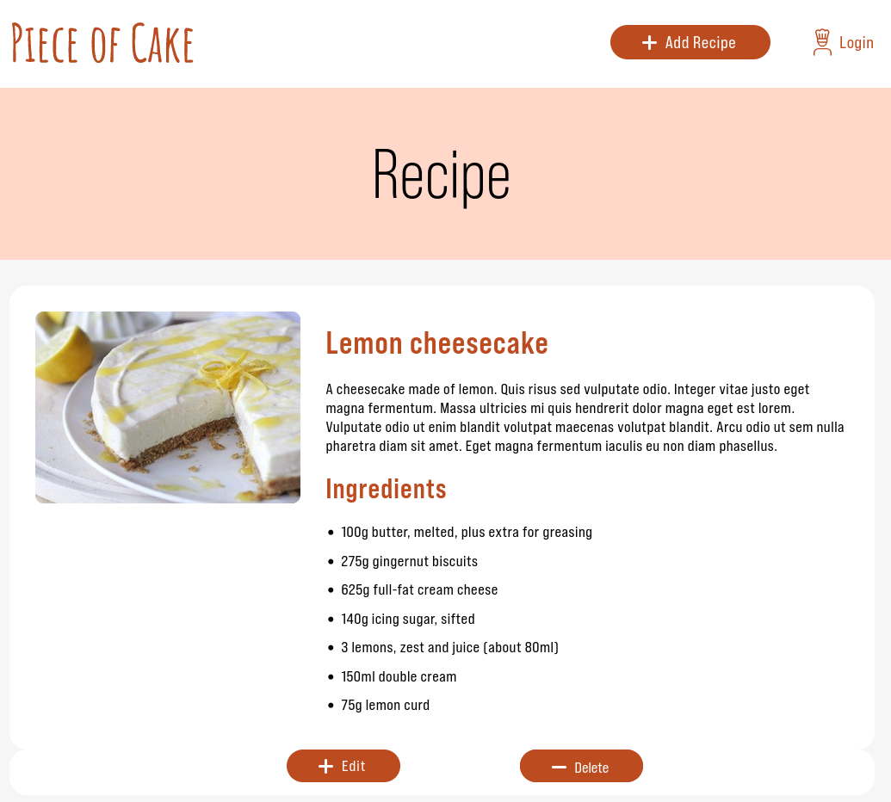
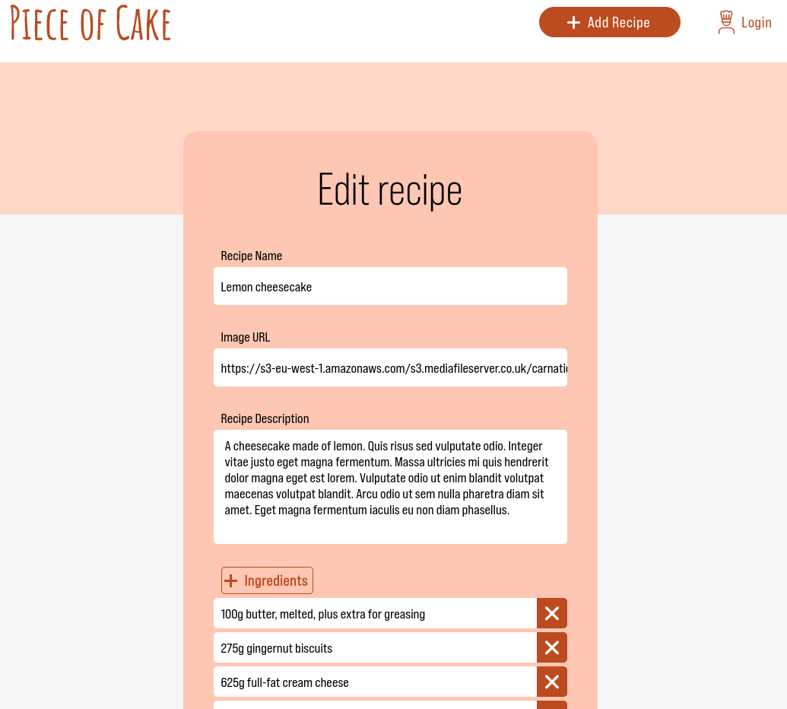
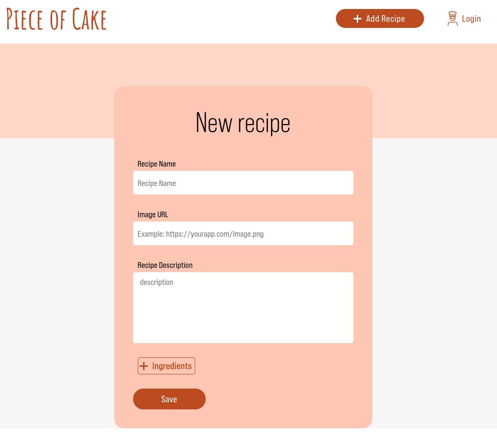

# Cake Manager - ReactJS (fictitious)

This is a front-end React app of [Waracle's Cake Manager Micro Service](https://github.com/Waracle/cake-manager) coding exercise.

Requirements:
* Display list of cake recipes.
* Display single cake recipe.
* Create a new cake recipe.
* Update an existing cake recipe.
* Delete an existing cake.

As a standalone project, I've added backend project, which recreates a dummy backend.

# How to run

## Pre-requisites
* You must have nodeJS installed. Version v20.12.2 or higher.
* Have port 3000 (dummy back-end) and port 5172 (front-end) free.

### Start the backend
* navigate to the backend folder: <code>cd ./backend </code>
* install dependencies: <code>npm install </code>
* start the backend: <code>npm start </code>
  * this will start the mock backend on port 3000

## run the React app
* on your cake-manager-front-end folder, install relevant dependencies: <code>npm install </code>
* start React app: <code>npm run dev</code>
   * this will start the app on port 5172 or higher.

# Stack used

* built using vite build tool (v5.2.0)
* reactJS (v18.2.0)
* react-hook-form (v7.52.1)
* react Router (v6.23.1)
* react query (v5.51.15)
* axios (v1.7.2)

# Screenshots
## Homepage

## View Cake Recipe

## Edit Recipe

## New Cake Recipe
